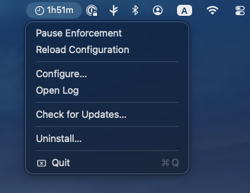
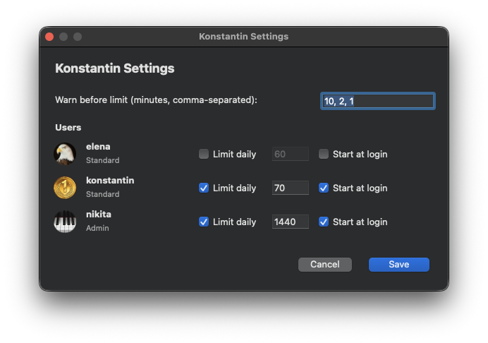

# Konstantin

Konstantin is a macOS menu-bar app that enforces daily screen-time
limits per user account. It's designed for parents, partners, or
anyone sharing a Mac who wants to give specific accounts a hard cap
on daily logged-in time and have macOS log them out when they hit it.

It runs as a system service, so limits apply across reboots, fast
user switching, and re-logins. There's no parental-controls profile,
no MDM, and no online account. Everything lives on disk in two
directories and can be removed with one menu click.

## Screenshots


The menu-bar app shows the current remaining time, daemon controls,
configuration, update checks, logs, and uninstall.



The configuration window lets an administrator choose which local
accounts are limited, set daily budgets, and manage login startup for
each user.


## What it does

* Tracks per-user logged-in time at the macOS console (Aqua sessions
  — SSH and remote terminals don't count).
* Resets each user's counter at local midnight.
* Pops a Notification Center warning at configurable thresholds
  (default `10`, `2`, and `1` minute remaining).
* When a user's limit reaches zero, logs them out automatically. They
  can log back in, but they get logged out again — there is no
  "borrow more time" button.
* Survives reboots, and can be paused system-wide by touching a
  single file (the kill-switch — your "oops, undo" lever).

## What it doesn't do

* It does **not** track app usage, web history, or anything per-app.
  All time spent logged in counts equally.
* It does **not** lock the screen, kill processes, or remove user
  data. The lockout is the same kind of soft logout you'd get from
  Apple menu → Log Out — open documents are saved, the user's data
  is preserved.
* It does **not** make any network connections. No telemetry, no
  reporting server, no remote configuration. Counters are kept in a
  single local JSON file at `/var/db/screentimed/state.json`.

## Install

### Homebrew (preferred)

```sh
brew tap gitopolis/konstantin
brew install --cask konstantin
```

### Manual

Download the latest `Konstantin-<version>-<arch>.zip` from the
[Releases](https://github.com/gitopolis/konstantin/releases) page,
unzip it, drag `Konstantin.app` into `/Applications`, and double-click.

The release bundle is Developer ID signed and notarized.

### First-launch setup

On first launch you'll see a *Set up Konstantin* alert. Click
`Set Up`. macOS may ask you to approve Konstantin's background service
in System Settings. After approval, the menu-bar icon appears.

By default:

* Enforcement is **on** — when a user hits their limit they actually
  get logged out. (You can flip this to log-only mode in `Configure…`
  while you're tuning limits.)
* The shipped config only lists `alice` and `bob` as limited
  accounts. Your own account is not in the config, so it has no
  limit. Use `Configure…` to add real accounts and set their daily
  budgets.
* `default_policy` is `unrestricted`, so any account *not* listed
  in the config has no limit either — Konstantin won't kick a user
  it doesn't know about.

This combination is intentionally cautious: enforcement is real, but
out of the box only the dummy accounts are subject to it, so you
won't accidentally lock anyone out before you've configured the
people you actually want to limit.

## Daily use

Click the menu-bar icon to see:

* A clock glyph plus the remaining-time display (e.g. `🕒 1h23m`,
  `🕒 12m05s`, `🕒 0s`). When the daemon is down, the clock goes
  muted gray and the time disappears.
* `Pause Enforcement` / `Unpause Enforcement` — toggles the daemon's
  kill-switch file so logging users out can be suspended without
  stopping the privileged service.
* `Reload Configuration` — asks the daemon to reload its root-owned
  config.
* `Configure…` — opens the settings window through the signed admin XPC
  channel. For each local user account you can:
  * Toggle a daily limit on/off.
  * Set the limit in minutes.
  * Toggle whether the menu-bar app starts at that user's login.
  
  There's also a single field for the warning thresholds (e.g.
  `10, 2, 1`) shared across all users. Save writes through the daemon
  and reloads configuration.
* `Open Log` — opens `/var/log/screentimed.log` for spot-checking.
* `Check for Updates…` — fetches the latest release from GitHub. If a
  newer version exists you'll be offered an `Update to X.Y.Z` button;
  the in-app updater verifies the download against the SHA-256 that
  GitHub publishes alongside each release asset, replaces the bundle,
  restarts the daemon, and relaunches the menu-bar app. If anything
  fails after the swap the previous version is restored automatically
  with no manual rollback. If you click
  `Later`, the menu item morphs to `Update to X.Y.Z` so you can
  install whenever you're ready.
* `Uninstall…` — removes the app, the daemon, and the per-user
  counter state. Preserves your config so a reinstall picks up
  the same settings.

## Counters and resets

* A counter advances only for the user currently at the keyboard
  (the foreground console user). A locked screen still counts. SSH
  and remote sessions don't.
* If you switch to another account via Fast User Switching, the
  previously-foreground user's counter pauses immediately and the
  newly-foreground user's counter starts ticking. Only one user
  accrues time at any moment, even though both stay logged in.
* Counters reset at local midnight on the machine. Daylight Saving
  jumps are handled — no drift.
* The default warning thresholds fire at 10, 2, and 1 minute
  remaining. Each fires at most once per day; the smallest
  applicable threshold wins on a late join (start the tray when
  you have 90 s left and you'll get the 1-minute warning, not the
  10-minute one).

## Pausing all enforcement

To temporarily disable enforcement system-wide without restarting
anything, create the kill-switch file:

```sh
sudo touch /etc/screentimed/disable
```

Counters keep ticking up, but no one gets logged out. To resume:

```sh
sudo rm /etc/screentimed/disable
```

You'll see `kill-switch present, refusing to enforce` warnings in
the daemon log while it's active.

## Uninstall

1. Click `Uninstall…` in the menu and the authorized daemon removes its
system files and counter state.
1. Drag `Konstantin.app` to the Trash to
remove the bundle.

`/etc/screentimed/config.toml` is preserved by default, in case you
reinstall. For a full wipe:

```sh
brew uninstall --zap konstantin    # if installed via brew
# or
sudo rm -rf /etc/screentimed/      # otherwise
```

## Privacy

Konstantin asks macOS who's currently at the console (via the
`SCDynamicStoreCopyConsoleUser` SystemConfiguration call) and nothing
else about user activity. No window titles, no app names, no
keystrokes, no network. The complete record of what the daemon knows
about a user is:

```json
{ "day": "2026-04-29", "counters": { "alice": 1842 } }
```

— a date and a per-user logged-in-second count. That file lives at
`/var/db/screentimed/state.json` and is wiped on uninstall.

The configuration file at `/etc/screentimed/config.toml` is mode 0600
root-owned, so other users on the machine can't read it (and so can't
discover whose limits are configured).

## Files on disk

| Path | What |
|------|------|
| `/Applications/Konstantin.app` | The app bundle. |
| `/usr/local/libexec/screentimed` | Privileged background service. |
| `/Library/LaunchDaemons/com.gitopolis.screentimed.plist` | Tells `launchd` to run the daemon. |
| `~/Library/LaunchAgents/com.gitopolis.konstantin-tray.plist` | Tells `launchd` to run the menu-bar app at your login. |
| `/etc/screentimed/config.toml` | Your settings. Mode 0600 root-owned. |
| `/var/db/screentimed/state.json` | Per-user counters. |
| `/var/log/screentimed.log` | Daemon log. |
| `/etc/screentimed/disable` | Kill-switch file. Touch to disable enforcement live. |

## For developers

Source code, architecture notes, and developer build instructions:

* [`AGENTS.md`](AGENTS.md) — design notes, architectural decisions,
  what's built and what isn't.
* [`docs/concepts.md`](docs/concepts.md) — IPC, counters, enforcement,
  midnight reset, kill-switch.
* [`docs/config.md`](docs/config.md) — every config field, with
  defaults and validation rules.
* [`docs/cli.md`](docs/cli.md) — binary flags and environment
  variables for the daemon, the headless `konstantin-status` CLI,
  and the tray.

Quick build:

```sh
cargo build --release
./packaging/build-app.sh         # writes target/Konstantin.app/
open target/Konstantin.app
```

## License

[Mozilla Public License 2.0](LICENSE).
